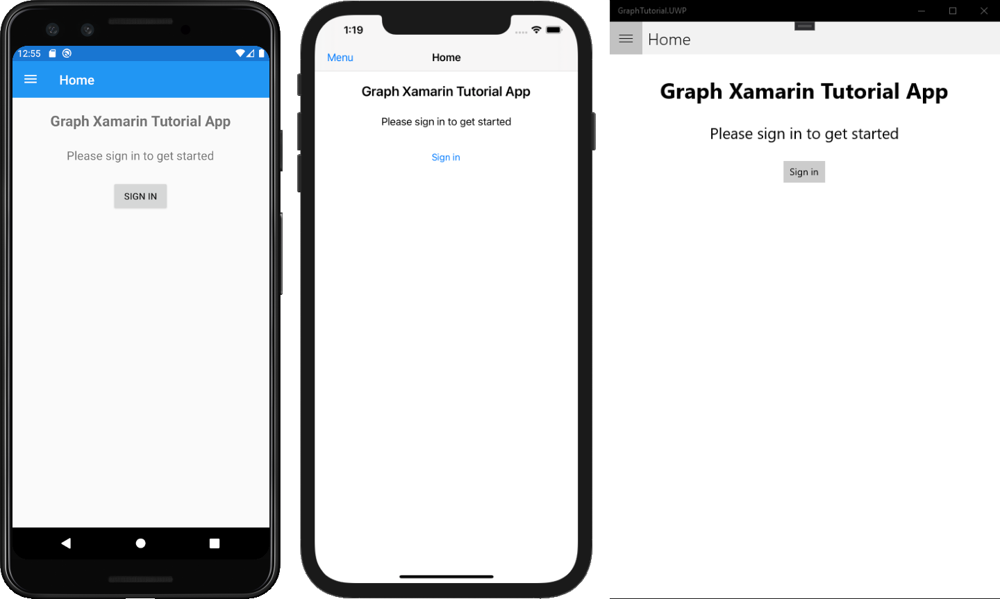

<!-- markdownlint-disable MD002 MD041 -->

1. Visual Studio を開き、**[新しいプロジェクトの作成]** を選択します。

1. [新しい **プロジェクトの作成] ダイアログで** 、[ **モバイル アプリ (Xamarin.Forms)] を** 選択し、[次へ] を **選択します**。

    ![Visual Studio 2019 [新しいプロジェクトの作成] ダイアログ ボックス](images/new-project-dialog.png)

1. [新しい **プロジェクトの構成]** ダイアログで、[プロジェクト名] と [ソリューションProject] を入力し、[作成 `GraphTutorial` ] を **選択します**。  

    > [!IMPORTANT]
    > これらのラボの手順で指定されているVisual Studio Project同じ名前を入力してください。 Visual Studio プロジェクトの名前が、コードでの名前空間の一部になります。 この手順のコードは、この手順で指定した Visual Studio プロジェクト名に一致する名前空間に応じて異なります。 異なるプロジェクト名を使用する場合には、Visual Studio プロジェクト作成時に入力したプロジェクト名に一致するようにすべての名前空間を調整しないと、コードがコンパイルされません。

    ![Visual Studio 2019 [新しいプロジェクトの構成] ダイアログ](images/configure-new-project-dialog.png)

1. [新しい **クロス プラットフォーム アプリ]** ダイアログで、[空のテンプレート] を選択し、[プラットフォーム] でビルドするプラットフォーム **を選択します**。 **[OK] を選択** してソリューションを作成します。

    

## <a name="install-packages"></a>パッケージのインストール

次に進む前に、後で使用NuGet追加のパッケージをインストールします。

- [Microsoft.Identity.Client を](https://www.nuget.org/packages/Microsoft.Identity.Client/) 使用して、Azure ADトークン管理を処理します。
- [Microsoft。Graph](https://www.nuget.org/packages/Microsoft.Graph/)Microsoft ユーザーに電話をGraph。
- [タイム ゾーンクロスプラットフォームを処理する TimeZoneConverter。](https://www.nuget.org/packages/TimeZoneConverter/)

1. **[ツール] > [NuGet パッケージ マネージャー] > [パッケージ マネージャー コンソール]** を選択します。

1. パッケージ マネージャー コンソールで、次のコマンドを入力します。

    ```Powershell
    Install-Package Microsoft.Identity.Client -Version 4.34.0 -Project GraphTutorial
    Install-Package Microsoft.Identity.Client -Version 4.34.0 -Project GraphTutorial.Android
    Install-Package Microsoft.Identity.Client -Version 4.34.0 -Project GraphTutorial.iOS
    Install-Package Microsoft.Graph -Version 4.0.0 -Project GraphTutorial
    Install-Package TimeZoneConverter -Project GraphTutorial
    ```

## <a name="design-the-app"></a>アプリを設計する

まず、クラスを更新して、認証状態とサインインしているユーザーを追跡する変数 `App` を追加します。

1. ソリューション **エクスプローラーで****GraphTutorial プロジェクトを展開** し **、App.xaml ファイルを展開** します。 **App.xaml.cs ファイルを開** き、ファイルの上部に次 `using` のステートメントを追加します。

    ```csharp
    using System.ComponentModel;
    using System.IO;
    using System.Reflection;
    using System.Threading.Tasks;
    ```

1. インターフェイスを `INotifyPropertyChanged` クラス宣言に追加します。

    ```csharp
    public partial class App : Application, INotifyPropertyChanged
    ```

1. クラスに次のプロパティを追加 `App` します。

    :::code language="csharp" source="../demo/GraphTutorial/GraphTutorial/App.xaml.cs" id="GlobalPropertiesSnippet":::

1. クラスに次の関数を追加 `App` します。 、 `SignIn` `SignOut` 、および `GetUserInfo` 関数は、今のところプレースホルダーにすらなっています。

    ```csharp
    public async Task SignIn()
    {
        await GetUserInfo();

        IsSignedIn = true;
    }

    public async Task SignOut()
    {
        UserPhoto = null;
        UserName = string.Empty;
        UserEmail = string.Empty;
        IsSignedIn = false;
    }

    private async Task GetUserInfo()
    {
        UserPhoto = ImageSource.FromStream(() => GetUserPhoto());
        UserName = "Adele Vance";
        UserEmail = "adelev@contoso.com";
    }

    private Stream GetUserPhoto()
    {
        // Return the default photo
        return Assembly.GetExecutingAssembly().GetManifestResourceStream("GraphTutorial.no-profile-pic.png");
    }
    ```

1. 関数 `GetUserPhoto` は、現在の既定の写真を返します。 独自のファイルを指定するか、サンプルで使用されているファイルをダウンロードするか、ファイルから[ダウンロードGitHub。](https://github.com/microsoftgraph/msgraph-training-xamarin/blob/master/tutorial/images/no-profile-pic.png) 独自のファイルを使用する場合は、名前を [no-profile-pic.png] **に変更します**。

1. ファイルを **./GraphTutorial/GraphTutorial ディレクトリにコピー** します。

1. ソリューション エクスプローラーでファイルを右クリックし **、[プロパティ** ] を **選択します**。 [プロパティ **] ウィンドウで** 、[ビルド アクション] の値 **を [埋め込み** リソース **] に変更します**。

    ![PNG ファイルの [プロパティ] ウィンドウのスクリーンショット](./images/png-file-properties.png)

### <a name="app-navigation"></a>アプリのナビゲーション

このセクションでは、アプリケーションのメイン ページを [FlyoutPage に変更します](/xamarin/xamarin-forms/app-fundamentals/navigation/flyoutpage)。 これにより、アプリの表示を切り替えるナビゲーション メニューが提供されます。

1. **GraphTutorial** **プロジェクトで MainPage.xaml** ファイルを開き、その内容を次に置き換えます。

    :::code language="xaml" source="../demo/GraphTutorial/GraphTutorial/MainPage.xaml":::

#### <a name="implement-the-menu"></a>メニューの実装

1. **GraphTutorial プロジェクトを右クリックし、[** 追加] 、[**新しいフォルダー**]**の順に選択します**。 フォルダーに `Models` という名前を指定します。

1. [モデル] フォルダーを **右クリックし**、[追加] **、[Class...] の順に選択します**。 クラスに名前を付 `NavMenuItem` け、[追加] を **選択します**。

1. **NavMenuItem.cs** ファイルを開き、その内容を次に置き換えてください。

    :::code language="csharp" source="../demo/GraphTutorial/GraphTutorial/Models/NavMenuItem.cs" id="NavMenuItemSnippet":::

1. **GraphTutorial プロジェクトを右クリックし、[** 追加] 、[**新しい** アイテム]**の順に選択します**。[コンテンツ **ページ] を選択** し、ページに名前を付きます `MenuPage` 。 **[追加]** を選択します。

1. **MenuPage.xaml ファイルを開** き、その内容を次に置き換えます。

    :::code language="xaml" source="../demo/GraphTutorial/GraphTutorial/MenuPage.xaml":::

1. ソリューション **エクスプローラーで MenuPage.xaml** **を展開し****、MenuPage.xaml.cs ファイルを開** きます。 その内容を次に置き換えてください。

    :::code language="csharp" source="../demo/GraphTutorial/GraphTutorial/MenuPage.xaml.cs" id="MenuPageSnippet":::

    > [!NOTE]
    > Visual Studio **MenuPage.xaml.cs でエラーが報告されます**。 これらのエラーは、後の手順で解決されます。

#### <a name="implement-the-welcome-page"></a>ウェルカム ページの実装

1. **GraphTutorial プロジェクトを右クリックし、[** 追加] 、[**新しい** アイテム]**の順に選択します**。[コンテンツ **ページ] を選択** し、ページに名前を付きます `WelcomePage` 。 **[追加]** を選択します。 **WelcomePage.xaml ファイルを開** き、その内容を次に置き換えます。

    :::code language="xaml" source="../demo/GraphTutorial/GraphTutorial/WelcomePage.xaml":::

1. ソリューション **エクスプローラーで WelcomePage.xaml** **を展開し****、WelcomePage.xaml.cs ファイルを開** きます。 次の関数を `WelcomePage` クラスに追加します。

    :::code language="csharp" source="../demo/GraphTutorial/GraphTutorial/WelcomePage.xaml.cs" id="OnSignInSnippet":::

#### <a name="add-calendar-and-new-event-pages"></a>予定表と新しいイベント ページを追加する

予定表ページと新しいイベント ページを追加します。 これらは今のところプレースホルダーです。

1. **GraphTutorial プロジェクトを右クリックし、[** 追加] 、[**新しい** アイテム]**の順に選択します**。[コンテンツ **ページ] を選択** し、ページに名前を付きます `CalendarPage` 。 **[追加]** を選択します。

1. **GraphTutorial プロジェクトを右クリックし、[** 追加] 、[**新しい** アイテム]**の順に選択します**。[コンテンツ **ページ] を選択** し、ページに名前を付きます `NewEventPage` 。 **[追加]** を選択します。

#### <a name="update-mainpage-code-behind"></a>MainPage のコードを更新する

すべてのページが配置されたので **、MainPage.xaml** の後ろのコードを更新します。

1. ソリューション **エクスプローラーで MainPage.xaml** **を** 展開し **、MainPage.xaml.cs** ファイルを開き、その内容全体を次に置き換えます。

    :::code language="csharp" source="../demo/GraphTutorial/GraphTutorial/MainPage.xaml.cs" id="MainPageSnippet":::

1. すべての変更を保存します。 実行するプロジェクト (Android、iOS、または UWP) を右クリックし **、[StartUp** ファイルとして設定] をProject。 F5 **キーを押** するか、または [デバッグ] **> [デバッグ** の開始] を選択Visual Studio。

    
